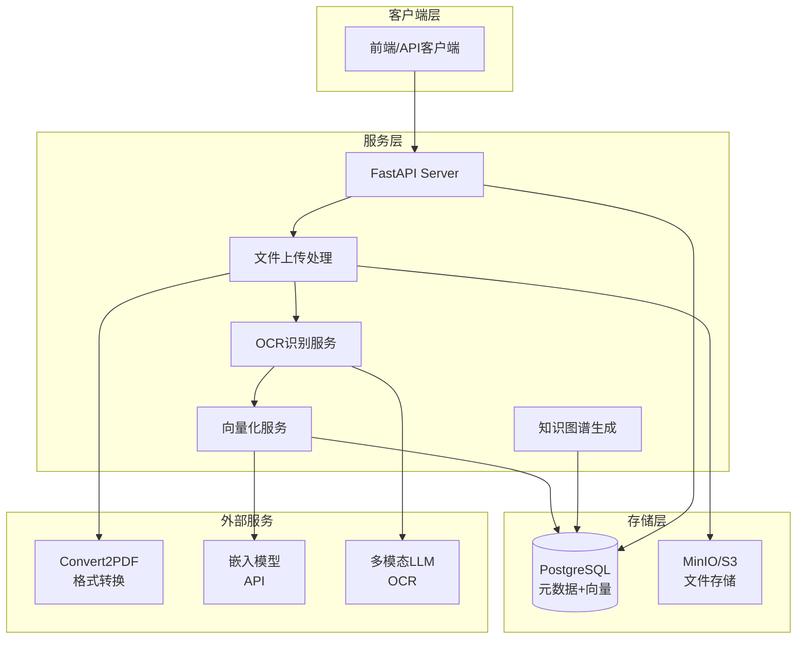
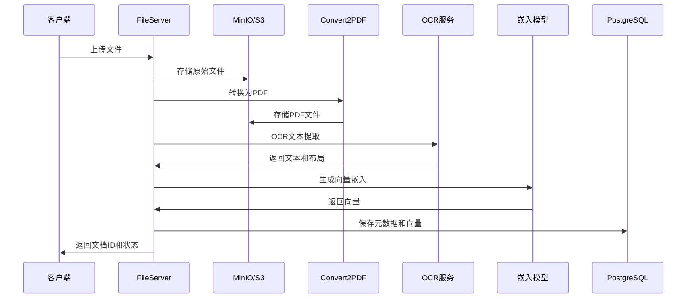

# OpenMonica FileServer - AI Agent 知识记忆系统

**为AI Agent提供"阅读"和"记忆"能力** - 让OpenMonica能像人类一样理解文档、记住知识、回忆信息

---

## 📖 模块概述

**OpenMonica FileServer** 是OpenMonica AI Agent平台的**知识记忆引擎**，赋予AI代理"阅读理解"和"长期记忆"能力。它不仅仅是一个文件存储服务，而是让AI Agent能够：

- 📖 **"阅读"文档** - 通过OCR和多模态模型理解PDF、图片、表格等各种格式
- 🧠 **"记住"知识** - 将文档内容向量化，存储为AI可检索的长期记忆
- 💡 **"回忆"信息** - 通过向量检索和全文搜索，让Agent在对话中快速找到相关知识
- 🔗 **"关联"概念** - 自动构建知识图谱，发现文档间的关联关系

**核心定位**：
- 🤖 **AI Agent的"大脑"** - 为个人助手提供知识库支撑，对标Monica的知识管理能力
- 🔍 **多模态理解** - 不只是文本，还能"看懂"图片、图表、手写笔记
- ⚡ **高性能处理** - 异步架构，支持大规模并发文档处理（1000+ docs/hour）
- 🏢 **企业级存储** - 集成MinIO/S3，支持PB级文档存储和管理

### 核心能力

- 📄 **多格式支持** - 支持PDF、DOC、DOCX、TXT、MD、图片、表格等20+种文档格式
- 🔍 **OCR识别** - 集成MinerU和Mistral AI多模态模型，高精度文本提取
- 🧮 **向量化** - 支持多种嵌入模型（bge-m3、text-embedding等），生成高质量向量
- ☁️ **对象存储** - 集成MinIO/S3，支持海量文档存储和CDN加速
- 🔄 **异步处理** - 基于异步队列的文档处理，支持高并发场景
- 📊 **知识图谱** - 自动构建文档间的关联关系和知识图谱
- 🗄️ **数据库集成** - 与PostgreSQL深度集成，支持向量检索和全文搜索

---

## 🏗️ 系统架构

### 整体架构图



### 文档处理流程



---

## 📦 目录结构

```
OpenMonica_fileserver/
├── app/
│   ├── v1/                          # V1版本API
│   │   ├── main.py                  # FastAPI应用入口
│   │   └── endpoints.py             # RESTful API端点
│   └── legacy/                      # 兼容旧版本
│       ├── main.py
│       ├── endpoints.py
│       └── compatibility_adapter.py # 适配器
├── src/
│   └── file_server_core/            # 核心库
│       ├── models/                  # 数据模型
│       │   ├── user.py
│       │   ├── knowledge_base.py
│       │   ├── document.py
│       │   └── processing.py
│       ├── server/                  # 服务器组件
│       │   ├── server.py
│       │   ├── database.py          # 数据库管理
│       │   ├── file_manager.py
│       │   └── storage.py
│       ├── storage/                 # 存储管理
│       │   └── manager.py
│       ├── ocr/                     # OCR处理
│       │   ├── base.py
│       │   ├── processor.py
│       │   ├── factory.py
│       │   ├── config/              # OCR配置
│       │   └── providers/           # OCR提供者
│       │       └── mistral.py
│       ├── parser/                  # 文档解析
│       │   └── base.py
│       ├── client/                  # 客户端SDK
│       │   └── client.py
│       └── utils/                   # 工具函数
│           ├── file_utils.py
│           └── config_utils.py
├── scripts/                         # 遗留脚本
│   ├── mineru_process_legacy.py
│   ├── graph_module_legacy.py
│   └── ...
├── examples/                        # 使用示例
│   ├── fast_start.py
│   └── async_cloud_usage_example.py
├── docs/                            # 文档
├── .env.example                     # 环境变量示例
├── pyproject.toml                   # 项目配置
├── setup.py                         # 安装脚本
└── README.md                        # 本文件
```

---

## ✨ 核心功能

### 1. 文件上传与管理

**支持的文件类型**：
- 文档：PDF, DOC, DOCX, TXT, MD, RTF
- 图片：PNG, JPG, JPEG, TIFF, BMP
- 表格：XLS, XLSX, CSV
- 其他：HTML, XML, JSON

**上传方式**：
- 直接上传文件（multipart/form-data）
- 通过URL上传（自动下载）

### 2. 文档处理模式

#### Simple模式（快速）
- 基础文本提取，不使用OCR
- 适用于纯文本文档
- 处理速度快，资源占用少

#### OCR模式（标准）
- 使用OCR技术提取图片和扫描文档中的文字
- 支持表格识别和布局分析
- 集成Mistral AI多模态模型

#### Graph模式（高级）
- 构建文档知识图谱
- 提取实体关系
- 支持文档间的语义关联

### 3. 向量化处理

**嵌入模型支持**：
- bge-m3（中英文混合）
- text-embedding-ada-002（OpenAI）
- 自定义嵌入模型

**向量存储**：
- 存储到PostgreSQL（pgvector扩展）
- 支持向量相似度搜索
- 自动创建向量索引

### 4. 知识库管理

**层级结构**：
```
用户 (User)
  └── 知识库 (Knowledge Base)
      └── 文档 (Document)
          └── 组件 (Component)
              ├── 文本块 (Chunk)
              ├── 图片 (Photo)
              └── 表格 (Table)
```

**功能**：
- 创建/删除知识库
- 文档上传/删除
- 文档列表查询
- 文档详情获取

---

## 🚀 快速开始

### 环境要求

- Python 3.11+
- PostgreSQL 16+（需安装pgvector扩展）
- MinIO或AWS S3兼容存储
- uv包管理工具（推荐）

### 安装步骤

```bash
# 1. 克隆项目
git clone <repository-url>
cd OpenMonica_fileserver

# 2. 安装依赖（使用uv）
uv sync

# 或使用pip
pip install -r requirements.txt

# 3. 配置环境变量
cp .env.example .env
vim .env  # 编辑配置
```

### 环境配置

创建`.env`文件：

```bash
# Mistral AI配置（OCR）
MISTRAL_API_KEY=your_mistral_api_key_here
MISTRAL_OCR_MODEL=mistral-ocr-latest

# PostgreSQL配置
PG_HOST=localhost
PG_PORT=5432
PG_DATABASE=postgres
PG_USER=postgres
PG_PASSWORD=your_password

# MinIO配置
MINIO_ENDPOINT=localhost:9000
MINIO_ACCESS_KEY=your_access_key
MINIO_SECRET_KEY=your_secret_key
MINIO_BUCKET=openmonica
MINIO_SECURE=false

# 嵌入模型配置
EMBEDDING_MODEL_URL=http://localhost:8000
EMBEDDING_MODEL_KEY=your_api_key
EMBEDDING_MODEL_NAME=bge-m3

# Convert2PDF服务配置
CONVERT2PDF_URL=http://localhost:7758
```

### 启动服务

```bash
# 开发模式（自动重载）
uv run uvicorn app.v1.main:app --host 0.0.0.0 --port 8087 --reload

# 生产模式
uv run uvicorn app.v1.main:app --host 0.0.0.0 --port 8087 --workers 4

# 使用Gunicorn（生产推荐）
gunicorn app.v1.main:app \
  --workers 4 \
  --worker-class uvicorn.workers.UvicornWorker \
  --bind 0.0.0.0:8087 \
  --timeout 300
```

### 验证部署

```bash
# 健康检查
curl http://localhost:8087/health

# 获取支持的文件类型
curl http://localhost:8087/v1/files/types
```

---

## 📚 API文档

### API版本

- **V1 API** - `/v1/*` - 推荐使用，RESTful风格
- **Legacy API** - `/legacy/*` - 兼容旧版本

### 核心端点

#### 1. 健康检查

```http
GET /health
```

**响应示例**：
```json
{
  "status": "ok"
}
```

---

#### 2. 获取支持的文件类型

```http
GET /v1/files/types
```

**响应示例**：
```json
{
  "status": "success",
  "message": "Supported file types retrieved",
  "data": {
    "supported_file_types": [
      ".pdf", ".doc", ".docx", ".txt", ".md",
      ".jpg", ".jpeg", ".png", ".xls", ".xlsx"
    ]
  }
}
```

---

#### 3. 上传文件

```http
POST /v1/files
Content-Type: multipart/form-data
```

**请求参数**：
| 参数 | 类型 | 必填 | 说明 |
|------|------|------|------|
| file | File | 是 | 上传的文件 |
| user_id | String | 否 | 用户ID，默认"default" |

**请求示例**：
```bash
curl -X POST http://localhost:8087/v1/files \
  -F "file=@document.pdf" \
  -F "user_id=user-123"
```

**响应示例**：
```json
{
  "status": "success",
  "message": "File uploaded successfully",
  "data": {
    "file_url": "https://minio.example.com/bucket/user-123/document.pdf",
    "file_id": "file_abc123",
    "mime_type": "application/pdf",
    "size": 1024567
  }
}
```

---

#### 4. 处理文件

```http
POST /v1/files/process
Content-Type: application/x-www-form-urlencoded
```

**请求参数**：
| 参数 | 类型 | 必填 | 说明 |
|------|------|------|------|
| user_id | String | 是 | 用户ID |
| file_url | String | 是 | 文件URL |
| knowledge_base_id | String | 否 | 知识库ID |
| mode | String | 否 | 处理模式（simple/normal），默认simple |

**请求示例**：
```bash
curl -X POST http://localhost:8087/v1/files/process \
  -d "user_id=user-123" \
  -d "file_url=https://minio.example.com/bucket/user-123/document.pdf" \
  -d "knowledge_base_id=kb-001" \
  -d "mode=simple"
```

**响应示例**：
```json
{
  "status": "success",
  "message": "File processed successfully",
  "data": {
    "user_id": "user-123",
    "knowledge_base_id": "kb-001",
    "mode": "simple",
    "file_url": "https://minio.example.com/bucket/user-123/document.pdf",
    "markdown_public_url": "https://minio.example.com/bucket/processed/document.md",
    "pdf_file_public_url": "https://minio.example.com/bucket/processed/document.pdf",
    "file_uuid": "uuid-abc-123"
  }
}
```

---

#### 5. 删除文件

```http
DELETE /v1/files/{file_id}
Content-Type: application/x-www-form-urlencoded
```

**路径参数**：
| 参数 | 类型 | 说明 |
|------|------|------|
| file_id | String | 文件ID |

**请求参数**：
| 参数 | 类型 | 必填 | 说明 |
|------|------|------|------|
| user_id | String | 是 | 用户ID |
| knowledge_base_id | String | 否 | 知识库ID |

**请求示例**：
```bash
curl -X DELETE http://localhost:8087/v1/files/file-123 \
  -d "user_id=user-123" \
  -d "knowledge_base_id=kb-001"
```

**响应示例**：
```json
{
  "status": "success",
  "message": "File deleted successfully"
}
```

---

#### 6. 知识库图谱管理

```http
POST /v1/knowledge-bases/{knowledge_base_id}/graph
Content-Type: application/x-www-form-urlencoded
```

**路径参数**：
| 参数 | 类型 | 说明 |
|------|------|------|
| knowledge_base_id | String | 知识库ID |

**请求参数**：
| 参数 | 类型 | 必填 | 说明 |
|------|------|------|------|
| user_id | String | 是 | 用户ID |
| mode | String | 是 | 操作模式（produce/get） |
| level | String | 是 | 图谱层级（document/subject） |

**生成文档图谱**：
```bash
curl -X POST http://localhost:8087/v1/knowledge-bases/kb-001/graph \
  -d "user_id=user-123" \
  -d "mode=produce" \
  -d "level=document"
```

**获取文档图谱**：
```bash
curl -X POST http://localhost:8087/v1/knowledge-bases/kb-001/graph \
  -d "user_id=user-123" \
  -d "mode=get" \
  -d "level=document"
```

---

## 💡 使用示例

### Python客户端示例

#### 1. 基础上传

```python
import httpx
from pathlib import Path

async def upload_file(file_path: str, user_id: str):
    """上传文件到FileServer"""
    url = "http://localhost:8087/v1/files"

    with open(file_path, "rb") as f:
        files = {"file": (Path(file_path).name, f)}
        data = {"user_id": user_id}

        async with httpx.AsyncClient() as client:
            response = await client.post(url, files=files, data=data)
            return response.json()

# 使用示例
result = await upload_file("document.pdf", "user-123")
print(f"Uploaded: {result['data']['file_url']}")
```

#### 2. 文档处理

```python
async def process_document(
    user_id: str,
    file_url: str,
    knowledge_base_id: str,
    mode: str = "simple"
):
    """处理文档"""
    url = "http://localhost:8087/v1/files/process"

    data = {
        "user_id": user_id,
        "file_url": file_url,
        "knowledge_base_id": knowledge_base_id,
        "mode": mode
    }

    async with httpx.AsyncClient(timeout=300) as client:
        response = await client.post(url, data=data)
        return response.json()

# 使用示例
result = await process_document(
    user_id="user-123",
    file_url="https://minio.example.com/bucket/document.pdf",
    knowledge_base_id="kb-001",
    mode="simple"
)
print(f"Document UUID: {result['data']['file_uuid']}")
```

#### 3. 批量上传

```python
import asyncio
from pathlib import Path

async def batch_upload(directory: str, user_id: str, knowledge_base_id: str):
    """批量上传目录中的所有文件"""
    files = Path(directory).glob("**/*.*")

    async def upload_and_process(file_path):
        # 上传
        upload_result = await upload_file(str(file_path), user_id)
        file_url = upload_result["data"]["file_url"]

        # 处理
        process_result = await process_document(
            user_id, file_url, knowledge_base_id
        )
        return process_result

    tasks = [upload_and_process(f) for f in files if f.is_file()]
    results = await asyncio.gather(*tasks)
    return results

# 使用示例
results = await batch_upload("./documents", "user-123", "kb-001")
print(f"Processed {len(results)} documents")
```

---

## 🗄️ 数据库Schema

### PostgreSQL表结构

FileServer使用以下数据表（由`server/database.py`创建）：

#### users表
```sql
CREATE TABLE IF NOT EXISTS users (
    id VARCHAR(50) PRIMARY KEY,
    username VARCHAR(100) UNIQUE NOT NULL,
    email VARCHAR(200),
    created_at TIMESTAMP DEFAULT CURRENT_TIMESTAMP,
    updated_at TIMESTAMP DEFAULT CURRENT_TIMESTAMP
);
```

#### knowledge_bases表
```sql
CREATE TABLE IF NOT EXISTS knowledge_bases (
    id VARCHAR(50) PRIMARY KEY,
    name VARCHAR(200) NOT NULL,
    description TEXT,
    user_id VARCHAR(50) REFERENCES users(id) ON DELETE CASCADE,
    settings JSONB DEFAULT '{}',
    created_at TIMESTAMP DEFAULT CURRENT_TIMESTAMP,
    updated_at TIMESTAMP DEFAULT CURRENT_TIMESTAMP
);
```

#### documents表
```sql
CREATE TABLE IF NOT EXISTS documents (
    id VARCHAR(50) PRIMARY KEY,
    filename VARCHAR(500) NOT NULL,
    original_filename VARCHAR(500) NOT NULL,
    file_size BIGINT NOT NULL,
    mime_type VARCHAR(100),
    file_hash VARCHAR(64),
    knowledge_base_id VARCHAR(50) REFERENCES knowledge_bases(id) ON DELETE CASCADE,
    user_id VARCHAR(50) REFERENCES users(id) ON DELETE CASCADE,
    storage_path TEXT,
    ocr_status VARCHAR(20) DEFAULT 'pending',
    ocr_result JSONB,
    metadata JSONB DEFAULT '{}',
    created_at TIMESTAMP DEFAULT CURRENT_TIMESTAMP,
    updated_at TIMESTAMP DEFAULT CURRENT_TIMESTAMP
);
```

#### document_processing表
```sql
CREATE TABLE IF NOT EXISTS document_processing (
    id SERIAL PRIMARY KEY,
    document_id VARCHAR(50) REFERENCES documents(id) ON DELETE CASCADE,
    processing_type VARCHAR(50) NOT NULL,
    status VARCHAR(20) DEFAULT 'pending',
    result JSONB,
    error_message TEXT,
    started_at TIMESTAMP DEFAULT CURRENT_TIMESTAMP,
    completed_at TIMESTAMP
);
```

---

## 🔧 配置说明

### config.yaml配置文件

```yaml
# 服务器组件配置
server_components:
  # PostgreSQL向量数据库
  pg_vector:
    host: "localhost"
    port: 5432
    user: "postgres"
    password: "your_password"
    database: "postgres"
    active: true
    min_pool_size: 5
    max_pool_size: 20

  # MinIO对象存储
  minio:
    host: "localhost"
    port: 9000
    access_key: "your_access_key"
    secret_key: "your_secret_key"
    bucket_name: "openmonica"
    region: "us-east-1"
    active: true
    public_url_prefix: "https://cdn.example.com"  # CDN加速前缀

  # Convert2PDF服务
  convert_format_server:
    - url: "http://localhost:7758"
      active: true

# API配置
api:
  # 语言嵌入模型
  language_embedding:
    - name: "bge-m3"
      url: "http://localhost:8000/v1/embeddings"
      key: "your_api_key"
      alias: "bge-m3"
      dimension: 1024

  # 多模态大模型（OCR）
  multimodal_llm:
    - name: "Qwen/Qwen2.5-VL-32B-Instruct"
      url: "http://localhost:8001/v1"
      key: "your_api_key"
      alias: "Qwen2.5-VL-32B-Instruct"
```

---

## 🐳 Docker部署

### Dockerfile

```dockerfile
FROM python:3.11-slim

WORKDIR /app

# 安装系统依赖
RUN apt-get update && apt-get install -y \
    build-essential \
    && rm -rf /var/lib/apt/lists/*

# 复制项目文件
COPY . .

# 安装Python依赖
RUN pip install --no-cache-dir -e .

# 暴露端口
EXPOSE 8087

# 启动命令
CMD ["uvicorn", "app.v1.main:app", "--host", "0.0.0.0", "--port", "8087"]
```

### docker-compose.yaml

```yaml
version: '3.8'

services:
  fileserver:
    build: .
    container_name: openmonica-fileserver
    ports:
      - "8087:8087"
    environment:
      - MISTRAL_API_KEY=${MISTRAL_API_KEY}
      - PG_HOST=postgres
      - PG_PORT=5432
      - PG_DATABASE=postgres
      - PG_USER=postgres
      - PG_PASSWORD=${PG_PASSWORD}
      - MINIO_ENDPOINT=minio:9000
      - MINIO_ACCESS_KEY=${MINIO_ACCESS_KEY}
      - MINIO_SECRET_KEY=${MINIO_SECRET_KEY}
    volumes:
      - ./config.yaml:/app/config.yaml
    depends_on:
      - postgres
      - minio
    networks:
      - openmonica-network

  postgres:
    image: postgres:16
    container_name: openmonica-postgres
    environment:
      - POSTGRES_PASSWORD=${PG_PASSWORD}
    volumes:
      - postgres-data:/var/lib/postgresql/data
    networks:
      - openmonica-network

  minio:
    image: minio/minio
    container_name: openmonica-minio
    command: server /data --console-address ":9001"
    environment:
      - MINIO_ROOT_USER=${MINIO_ACCESS_KEY}
      - MINIO_ROOT_PASSWORD=${MINIO_SECRET_KEY}
    ports:
      - "9000:9000"
      - "9001:9001"
    volumes:
      - minio-data:/data
    networks:
      - openmonica-network

volumes:
  postgres-data:
  minio-data:

networks:
  openmonica-network:
    driver: bridge
```

### 启动服务

```bash
# 启动所有服务
docker-compose up -d

# 查看日志
docker-compose logs -f fileserver

# 停止服务
docker-compose down
```

---

## 🔍 性能优化

### 1. 数据库连接池

```python
# server/database.py
self.pool = await asyncpg.create_pool(
    host=self.config.get("host", "localhost"),
    port=self.config.get("port", 5432),
    database=self.config.get("database", "file_server"),
    user=self.config.get("user", "postgres"),
    password=self.config.get("password", ""),
    min_size=5,      # 最小连接数
    max_size=20,     # 最大连接数
    command_timeout=30
)
```

### 2. 文件去重

系统通过文件哈希实现去重：

```python
# 检查文件是否已存在
existing_doc_id = await db.check_file_exists(file_hash, user_id)
if existing_doc_id:
    # 返回已存在的文档ID，避免重复处理
    return {"document_id": existing_doc_id, "status": "exists"}
```

### 3. 异步处理

所有IO操作使用async/await：

```python
# 异步上传到MinIO
async with aiohttp.ClientSession() as session:
    await upload_to_minio(session, file_data, filename)

# 异步数据库操作
async with db.get_connection() as conn:
    await conn.execute(query, *params)
```

---

## ⚠️ 常见问题

### 1. OCR处理失败

**问题**：OCR识别返回错误或超时

**解决方案**：
```bash
# 检查Mistral API配置
echo $MISTRAL_API_KEY

# 增加超时时间
# 在代码中设置更长的timeout
async with httpx.AsyncClient(timeout=600) as client:
    ...
```

### 2. MinIO连接失败

**问题**：无法连接到MinIO服务

**解决方案**：
```bash
# 检查MinIO服务状态
docker ps | grep minio

# 测试连接
mc alias set myminio http://localhost:9000 ACCESS_KEY SECRET_KEY
mc ls myminio

# 创建bucket
mc mb myminio/openmonica
```

### 3. 向量维度不匹配

**问题**：嵌入向量维度与数据库配置不一致

**解决方案**：
```sql
-- 检查当前向量维度
SELECT column_name, data_type
FROM information_schema.columns
WHERE table_name = 'components' AND column_name = 'embedding';

-- 如需修改，需要重建表或使用固定维度
ALTER TABLE chunk_schema.components
ALTER COLUMN embedding TYPE vector(1024);  -- 修改为正确维度
```

### 4. 内存占用过高

**问题**：处理大文件时内存占用过高

**解决方案**：
```python
# 使用流式读取
async def stream_upload(file_path: str):
    async with aiofiles.open(file_path, 'rb') as f:
        chunk_size = 1024 * 1024  # 1MB
        while True:
            chunk = await f.read(chunk_size)
            if not chunk:
                break
            # 处理chunk
```

---

## 📊 监控与日志

### 日志配置

系统使用loguru进行日志记录：

```python
from loguru import logger

# 配置日志
logger.add(
    "logs/fileserver_{time}.log",
    rotation="500 MB",
    retention="10 days",
    level="INFO"
)

# 记录日志
logger.info(f"Processing file: {filename}")
logger.error(f"Error occurred: {error}")
```

### 性能监控

```python
import time

async def monitor_processing(func):
    """装饰器：监控处理时间"""
    async def wrapper(*args, **kwargs):
        start_time = time.time()
        result = await func(*args, **kwargs)
        elapsed = time.time() - start_time
        logger.info(f"{func.__name__} took {elapsed:.2f}s")
        return result
    return wrapper
```

---

## 🧪 测试

### 运行测试

```bash
# 安装测试依赖
uv sync --group dev

# 运行所有测试
pytest

# 运行特定测试
pytest tests/test_file_upload.py

# 生成覆盖率报告
pytest --cov=src --cov-report=html
```

### 测试示例

```python
import pytest
from httpx import AsyncClient

@pytest.mark.asyncio
async def test_upload_file():
    async with AsyncClient(base_url="http://localhost:8087") as client:
        with open("test.pdf", "rb") as f:
            response = await client.post(
                "/v1/files",
                files={"file": f},
                data={"user_id": "test-user"}
            )
        assert response.status_code == 200
        assert response.json()["status"] == "success"
```

---

## 📄 许可证

MIT License - 详见项目根目录LICENSE文件

---

## 🔗 相关链接

- [项目主页](../../README.md)
- [数据库模块](../openmonica_sql/README.md)
- [用户管理服务](../OpenMonica_UserManagement/README.md)
- [核心问答服务](../OpenMonica_main/README.md)

---

<div align="center">

**[⬆ 返回顶部](#openmonica-fileserver---文档处理与知识库管理服务)**

</div>
