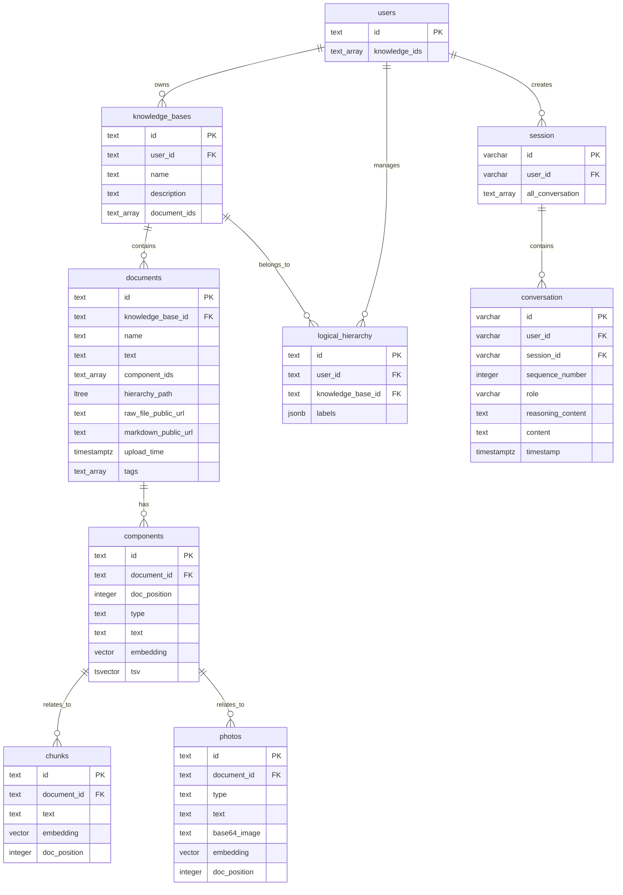

# 知识库管理系统数据库架构文档

## 1. 系统概述

本数据库设计用于支持一个智能知识库管理系统，主要功能包括：
- 用户管理和权限控制
- 知识库的创建、管理和组织
- 文档上传、解析和分块处理
- 向量化检索和全文搜索
- 对话历史管理
- 层级标签管理

系统采用PostgreSQL作为主数据库，利用多种扩展插件提供向量检索、中文分词、全文搜索等高级功能。

## 2. 系统架构

### 2.1 Schema 设计
系统采用多Schema架构设计：
- **chunk_schema**: 知识库核心数据管理
- **procedure**: 对话过程管理
- **public**: 系统扩展和配置

### 2.2 核心扩展插件

| 扩展名称      | 作用     | 功能描述                     |
| ------------- | -------- | ---------------------------- |
| vector        | 向量支持 | 提供向量数据类型和相似度检索 |
| vectorscale   | 向量优化 | 向量数据的性能优化           |
| rum           | 全文检索 | 高性能倒排索引               |
| pg_jieba      | 中文分词 | 中文文本分词和检索           |
| ltree         | 层级结构 | 支持树形层级数据             |
| pgcrypto      | 加密功能 | UUID生成和数据加密           |
| timescaledb   | 时序数据 | 时间序列数据优化             |
| http          | 网络连接 | HTTP请求功能                 |
| pg_background | 后台任务 | 异步任务执行                 |
| pg_cron       | 定时任务 | 定时作业调度                 |

## 3. 数据库表结构

### 3.1 实体关系图 (ERD)

### 3.2 表详细说明

#### 3.2.1 chunk_schema.users (用户表)

| 字段名        | 类型   | 约束         | 描述                   |
| ------------- | ------ | ------------ | ---------------------- |
| id            | TEXT   | PK           | 用户唯一标识符         |
| knowledge_ids | TEXT[] | DEFAULT '{}' | 用户拥有的知识库ID列表 |

**用途**: 管理系统用户基本信息，维护用户与知识库的关联关系。

#### 3.2.2 chunk_schema.knowledge_bases (知识库表)

| 字段名       | 类型   | 约束         | 描述             |
| ------------ | ------ | ------------ | ---------------- |
| id           | TEXT   | PK           | 知识库唯一标识符 |
| user_id      | TEXT   | FK, NOT NULL | 所属用户ID       |
| name         | TEXT   |              | 知识库名称       |
| description  | TEXT   |              | 知识库描述       |
| document_ids | TEXT[] | DEFAULT '{}' | 包含的文档ID列表 |

**用途**: 管理知识库基本信息，组织文档集合。

#### 3.2.3 chunk_schema.documents (文档表)

| 字段名              | 类型        | 约束                      | 描述                         |
| ------------------- | ----------- | ------------------------- | ---------------------------- |
| id                  | TEXT        | PK                        | 文档唯一标识符               |
| knowledge_base_id   | TEXT        | FK, NOT NULL              | 所属知识库ID                 |
| name                | TEXT        |                           | 文档名称                     |
| text                | TEXT        |                           | 文档完整文本内容（自动生成） |
| component_ids       | TEXT[]      | DEFAULT '{}'              | 文档组件ID列表               |
| hierarchy_path      | LTREE       | DEFAULT 'root'            | 文档层级路径                 |
| raw_file_public_url | TEXT        |                           | 原始文件公开URL              |
| markdown_public_url | TEXT        |                           | Markdown文件公开URL          |
| upload_time         | TIMESTAMPTZ | DEFAULT CURRENT_TIMESTAMP | 上传时间                     |
| tags                | TEXT[]      | DEFAULT '{}'              | 文档标签                     |

**用途**: 存储文档元数据和内容，支持层级分类和标签管理。

#### 3.2.4 chunk_schema.components (文档组件表)

| 字段名       | 类型     | 约束                               | 描述           |
| ------------ | -------- | ---------------------------------- | -------------- |
| id           | TEXT     | PK                                 | 组件唯一标识符 |
| document_id  | TEXT     | FK, NOT NULL                       | 所属文档ID     |
| doc_position | INTEGER  | NOT NULL                           | 在文档中的位置 |
| type         | TEXT     | CHECK IN ('chunk','photo','table') | 组件类型       |
| text         | TEXT     |                                    | 组件文本内容   |
| embedding    | VECTOR   |                                    | 文本向量嵌入   |
| tsv          | TSVECTOR |                                    | 全文搜索索引   |

**约束**: UNIQUE(document_id, doc_position)

**用途**: 统一管理文档中的各种组件（文本块、图片、表格），支持向量检索和全文搜索。

#### 3.2.5 chunk_schema.chunks (文本分块表)

| 字段名       | 类型    | 约束         | 描述           |
| ------------ | ------- | ------------ | -------------- |
| id           | TEXT    | PK           | 分块唯一标识符 |
| document_id  | TEXT    | FK, NOT NULL | 所属文档ID     |
| text         | TEXT    |              | 分块文本内容   |
| embedding    | VECTOR  |              | 文本向量嵌入   |
| doc_position | INTEGER |              | 在文档中的位置 |

**用途**: 存储文档的文本分块，支持细粒度的向量检索。

#### 3.2.6 chunk_schema.photos (图片表)

| 字段名       | 类型    | 约束                       | 描述             |
| ------------ | ------- | -------------------------- | ---------------- |
| id           | TEXT    | PK                         | 图片唯一标识符   |
| document_id  | TEXT    | FK, NOT NULL               | 所属文档ID       |
| type         | TEXT    | CHECK IN ('photo','table') | 图片类型         |
| text         | TEXT    |                            | 图片详细描述     |
| base64_image | TEXT    |                            | 图片Base64编码   |
| embedding    | VECTOR  |                            | 描述文本向量嵌入 |
| doc_position | INTEGER |                            | 在文档中的位置   |

**用途**: 管理文档中的图片和表格，通过描述文本支持语义检索。

#### 3.2.7 chunk_schema.logical_hierarchy (逻辑层级表)

| 字段名            | 类型  | 约束         | 描述               |
| ----------------- | ----- | ------------ | ------------------ |
| id                | TEXT  | PK           | 层级配置唯一标识符 |
| user_id           | TEXT  | FK, NOT NULL | 所属用户ID         |
| knowledge_base_id | TEXT  | FK, NOT NULL | 所属知识库ID       |
| labels            | JSONB | DEFAULT '[]' | 标签层级配置       |

**用途**: 管理知识库内的标签层次结构，支持灵活的分类体系。

#### 3.2.8 procedure.session (会话表)

| 字段名           | 类型         | 约束         | 描述               |
| ---------------- | ------------ | ------------ | ------------------ |
| id               | VARCHAR(255) | PK           | 会话唯一标识符     |
| user_id          | VARCHAR(255) | FK, NOT NULL | 所属用户ID         |
| all_conversation | TEXT[]       |              | 会话中的所有对话ID |

**用途**: 管理用户会话，维护对话历史的完整性。

#### 3.2.9 procedure.conversation (对话表)

| 字段名            | 类型         | 约束         | 描述                          |
| ----------------- | ------------ | ------------ | ----------------------------- |
| id                | VARCHAR(255) | PK           | 对话唯一标识符                |
| user_id           | VARCHAR(255) | FK, NOT NULL | 所属用户ID                    |
| session_id        | VARCHAR(255) | FK, NOT NULL | 所属会话ID                    |
| sequence_number   | INTEGER      |              | 对话序号                      |
| role              | VARCHAR(50)  | NOT NULL     | 角色（user/assistant/system） |
| reasoning_content | TEXT         |              | 推理过程内容                  |
| content           | TEXT         | NOT NULL     | 对话内容                      |
| timestamp         | TIMESTAMPTZ  | NOT NULL     | 对话时间戳                    |

**用途**: 存储具体的对话内容，支持多轮对话和推理过程追踪。

## 4. 索引设计

### 4.1 性能优化索引

| 索引名称                      | 表名              | 字段                      | 类型  | 用途             |
| ----------------------------- | ----------------- | ------------------------- | ----- | ---------------- |
| documents_hierarchy_path_idx  | documents         | hierarchy_path            | GIST  | 层级路径查询优化 |
| components_doc_position_idx   | components        | document_id, doc_position | BTREE | 文档组件位置查询 |
| components_tsv_idx            | components        | tsv                       | RUM   | 全文搜索优化     |
| logical_hierarchy_user_id_idx | logical_hierarchy | user_id                   | BTREE | 用户标签查询     |
| logical_hierarchy_kb_id_idx   | logical_hierarchy | knowledge_base_id         | BTREE | 知识库标签查询   |
| idx_user_session              | conversation      | user_id, session_id       | BTREE | 对话查询优化     |

## 5. 触发器系统

### 5.1 数据同步触发器

#### 5.1.1 用户-知识库关联同步
- **触发器**: `knowledge_base_after_insert_update`
- **函数**: `update_user_knowledge_uuids()`
- **作用**: 知识库变更时自动更新用户的knowledge_ids字段

#### 5.1.2 知识库-文档关联同步
- **触发器**: `document_after_trigger`
- **函数**: `update_knowledge_base_document_ids()`
- **作用**: 文档变更时自动更新知识库的document_ids字段

#### 5.1.3 文档-组件关联同步
- **触发器**: `components_after_trigger`
- **函数**: `update_component_document_ids()`
- **作用**: 组件变更时自动更新文档的component_ids字段

### 5.2 数据一致性触发器

#### 5.2.1 组件位置唯一性保证
- **触发器**: `components_before_insert_update`
- **函数**: `ensure_doc_position_uniqueness()`
- **作用**: 确保同一文档内组件位置的唯一性和顺序性

#### 5.2.2 文档内容自动更新
- **触发器**: `components_update_document_text`
- **函数**: `update_document_content()`
- **作用**: 组件变更时自动重新生成文档的完整文本

#### 5.2.3 全文搜索索引更新
- **触发器**: `components_tsv_trigger`
- **函数**: `update_component_tsv()`
- **作用**: 组件文本变更时自动更新中文分词索引

### 5.3 数据同步触发器

#### 5.3.1 文本块同步
- **触发器**: `chunks_after_insert_update`
- **函数**: `sync_chunks_to_components()`
- **作用**: 将chunks表的变更同步到components表

#### 5.3.2 图片同步
- **触发器**: `photos_after_insert_update`
- **函数**: `sync_photos_to_components()`
- **作用**: 将photos表的变更同步到components表

## 6. 约束和规则

### 6.1 外键约束
- 所有子表都通过外键关联到父表，并设置级联删除
- 用户删除时会级联删除其所有知识库、文档和对话数据
- 知识库删除时会级联删除其所有文档和层级配置
- 文档删除时会级联删除其所有组件数据

### 6.2 检查约束
- `components.type`: 限制为 'chunk', 'photo', 'table'
- `photos.type`: 限制为 'photo', 'table'

### 6.3 唯一性约束
- `components`: (document_id, doc_position) 组合唯一

## 7. 数据流和业务逻辑

### 7.1 文档上传流程
1. 用户上传文档到指定知识库
2. 系统解析文档，生成chunks和photos记录
3. 触发器自动创建对应的components记录
4. 触发器自动更新documents表的完整文本
5. 触发器自动更新知识库的document_ids
6. 触发器自动更新用户的knowledge_ids

### 7.2 检索流程
1. 向量检索：基于embedding字段进行相似度搜索
2. 全文检索：基于tsv字段进行关键词搜索
3. 层级检索：基于hierarchy_path进行分类搜索
4. 标签检索：基于tags和logical_hierarchy进行标签搜索

### 7.3 对话管理流程
1. 创建新会话或继续现有会话
2. 记录每轮对话的用户输入和AI响应
3. 维护对话序号确保顺序性
4. 支持推理过程的记录和追踪

## 8. 性能优化建议

### 8.1 查询优化
- 使用RUM索引进行全文搜索，性能优于GIN索引
- 利用GIST索引进行层级路径查询
- 合理使用向量索引进行相似度检索

### 8.2 存储优化
- 大文件使用外部存储，数据库仅存储URL引用
- 向量数据使用vectorscale扩展进行压缩和优化
- 定期清理过期的对话和临时数据

### 8.3 并发控制
- 触发器中使用FOR UPDATE锁定避免并发冲突
- 批量操作时考虑分批处理避免长事务

## 9. 维护和监控

### 9.1 定期维护任务
- 使用pg_cron调度定期VACUUM和ANALYZE
- 定期更新向量索引统计信息
- 监控数据库连接数和查询性能

### 9.2 备份策略
- 定期全量备份和增量备份
- 重要表的实时复制
- 向量数据的专门备份策略

## 10. 安全考虑

### 10.1 数据安全
- 敏感数据使用pgcrypto进行加密
- 严格的权限控制和用户隔离
- 审计日志记录重要操作

### 10.2 访问控制
- 基于用户ID的数据隔离
- 知识库级别的权限控制
- API访问的身份验证和授权

---

*文档版本: 1.0*  
*更新日期: 2025年9月*  
*维护人员: 开发团队*